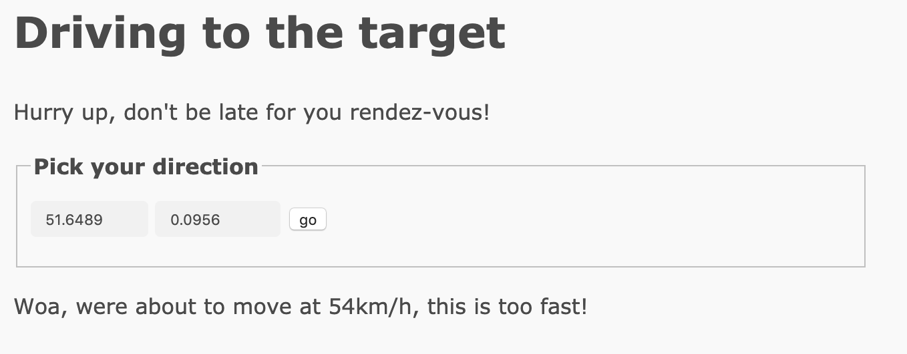

###Driving to the target

`Tag: Coding`

Excellent work!  With your fine sleuthing skills, you managed to find a picture of the handsome creature with its pet biped.  At last friends and companionship may be near!

Like all inhabitants of this world, you spend an inordinate amount of time on the site, stalking and comparing your life to that of others. The first thought that springs to your mind is "Why haven't I ever been to Mauritius on holiday?" followed swiftly by "What is a Mauritius anyway?" But after a while and with language successfully deciphered, you've made contact with the lifeform in the picture, you have a "date"? You're given the address of where to meet your potential interest. "1 Banana way, beware of the glass." An odd address, especially that last part. So how do you get there?  You land your ship and begin to search.

## Solution

We are given a web address `https://drivetothetarget.web.ctfcompetition.com/`. There is an input of 2 numbers and a `go` submission. Trying to change any of the numbers significantly pops up with a message that we tried to travel too far or too fast.

Changing the left number by 0.0001 lets us travel 11m. Changing the right by 0.0001 travels 6m. If we decrease either number we are told that we are getting closer to the rendez-vous.

Inspecting the site reveals that the numbers are latitude and longitude. Inputting the original coordinates into maps puts the location in North East London, UK and also experimenting with the inputs its easy to see that the general correct direction is South West, into Central London.

It appears we may need a brute force algorithm here to test many combinations of coordinates while heading in the correct direction. I implemented some initial code to decrement the latitude by 0.0001 each time but kept receiving a message `Woa, were about to move at 68km/h, this is too fast!`. This appears to be a result of how fast we input the next coordinates. So I slowed down my program a bit by using time.sleep() to sleep for 0.2 seconds. However this still created some speed issues so I had to slow this down to 0.5 seconds. Evidently the program will take quite a long time to run. I left it running while I potentially figure out an alternative method, likely to do with the token as it shows some patterns.

From the brute force method the final coordinates were 51.4923, -0.1930 and the flag is `CTF{Who_is_Tardis_Ormandy}`.
